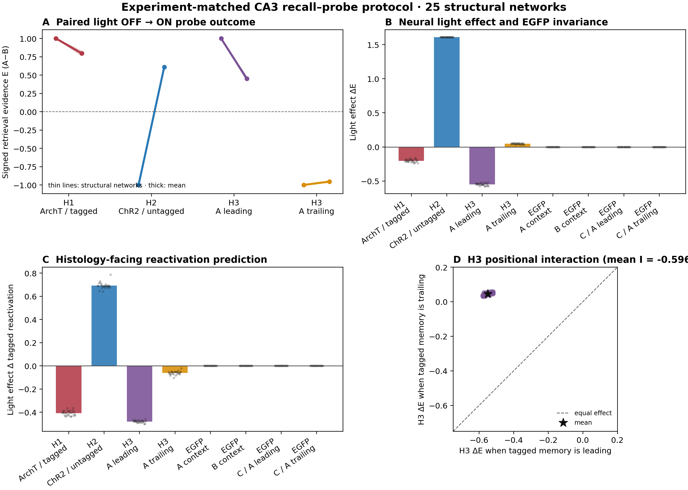
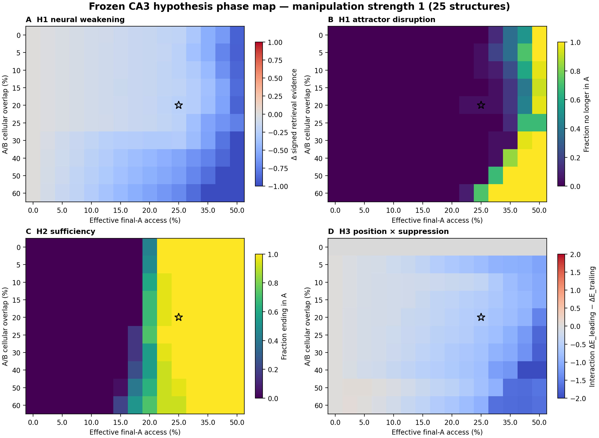

# CA3 Attractor Model v1.0

Minimal, theory-driven computational model of CA3 pattern completion, engram
competition, and activity-dependent engram manipulation.

This repository contains the frozen pre-data model, validation analyses,
hypothesis-oriented recall–probe protocol, and generated results. The model is
an abstract cellular attractor network; it is not a biophysical simulation of
mouse CA3 and does not simulate spikes, opsin kinetics, or animal behavior.

## Scientific objective

The model formalizes three questions about two competing hippocampal memories:

1. **Necessity (H1):** Does suppressing an accessible subset of memory A weaken
   or abolish A recall?
2. **Sufficiency (H2):** Can activating the same A-tagged population drive the
   network from a B state into the A attractor?
3. **Competition (H3):** Does suppressing A have a larger effect when A is
   currently favored than when A is already the weaker competitor?

These questions are evaluated at the level of CA3 attractor dynamics. The
experimental terms RAM tagging, ArchT, ChR2, context, and cue are represented
as cellular sets and positive or negative external fields.

## Theoretical framework

### Sparse covariance attractor

The network contains two binary memory patterns, `A` and `B`, with explicit
cellular overlap. For pattern activity fraction `a`, the recurrent weights are
defined by a centered covariance-Hebbian rule:

```text
W_ij = [1 / (N a (1-a))] Σ_mu (xi_i^mu-a)(xi_j^mu-a),   W_ii = 0
```

The code evaluates the recurrent field in factorized `O(NP)` form rather than
constructing a dense `N × N` matrix. Unit tests verify numerical equivalence to
the dense zero-diagonal covariance matrix.

The framework is consistent with sparse autoassociative models of overlapping
engrams ([Gastaldi et al., 2021](https://doi.org/10.1371/journal.pcbi.1009691)).
Its interpretation as a CA3 memory model is grounded in experimental and
computational evidence for recurrent CA3 pattern completion
([Neunuebel & Knierim, 2014](https://doi.org/10.1016/j.neuron.2013.11.017);
[Guzman et al., 2016](https://doi.org/10.1126/science.aaf1836)) and broad,
symmetric CA3–CA3 plasticity
([Mishra et al., 2016](https://doi.org/10.1038/ncomms11552)).

### Global inhibition and state update

Fast global inhibitory normalization is represented by a hard sparse activity
cap. At each synchronous update, cells above the activation threshold compete
for at most `round(N × max_active_fraction)` active positions. This is a
reduced theoretical constraint, not a claim about a specific interneuron
microcircuit.

A partial external cue is applied for a specified number of update steps and
can then be removed. Recurrent dynamics continue until the network reaches a
fixed point, a detected cycle, or the safety limit. If a short synchronous
microstate cycle occurs, protocol-level readouts use a complete-cycle average
and require attractor identity to remain stable throughout the cycle.

### Experimental-to-computational mapping

| Experimental concept | Computational representation |
|---|---|
| Memory A / memory B | Two learned, sparse, overlapping binary patterns |
| Context A / context B | External support directed to the corresponding pattern |
| Ambiguous cue | Fixed cue-target budget divided between A and B by learned support `lambda` |
| RAM-tagged ensemble | Sampled subset of the representation active during tagging |
| Tag–test stability | Fraction of the tagging representation retained in final memory A |
| Fiber/expression coverage | Light-accessible subset of tagged cells |
| ArchT-like suppression | Negative field on accessible tagged cells |
| ChR2-like activation | Positive field on accessible tagged cells |
| EGFP control | No manipulation field |
| Engram reactivation | Active tagged cells divided by all tagged cells |

The cue support `lambda` represents learned relative evidence for A versus B;
it is not physical sound intensity. Cue amplitude and allocation are kept as
separate quantities.

## Model configuration

The frozen pilot configuration is stored in
[`params/ca3_sparse_attractor_v1.yaml`](params/ca3_sparse_attractor_v1.yaml).

| Parameter | v1.0 value | Interpretation |
|---|---:|---|
| Number of binary CA3 cells | 2,400 | Computational resolution, not anatomical cell count |
| Engram fraction | 0.08 | 192 cells per memory at the default scale |
| A/B overlap | 0.20 | Approximately 38 cells shared by A and B |
| Maximum active fraction | 0.08 | Reduced global inhibitory constraint |
| Activation threshold | 0.12 | Midpoint of the independently valid `0.08–0.16` plateau |
| Partial-cue target fraction | 0.20 | Fraction of an engram directly cued |
| Tagging efficiency | 0.50 | Pilot/free parameter pending measurement |
| Fiber coverage | 0.50 | Pilot/free parameter pending measurement |
| Tag–test match | 1.00 | Pilot/free parameter pending measurement |

Engram fraction, overlap, tagging efficiency, fiber coverage, tag–test match,
and neural-to-behavioral mapping are not treated as measured biological values.
They remain explicit calibration targets for future pilot data.

## Readouts

The model keeps attractor identity, absolute retrieval evidence, and tagged
reactivation separate:

```text
NCI = (A_unique - B_unique) / (A_unique + B_unique)
E   =  A_unique - B_unique
```

- `NCI` identifies the dominant attractor.
- `E` preserves the absolute signed strength of A-versus-B retrieval.
- Tagged reactivation is compared with the active population fraction as its
  structural chance level.
- A bounded behavioral sensitivity envelope is defined as
  `tanh(beta × E / 2)`. `beta` is not calibrated to digging behavior and is
  swept rather than selected as an empirical value.

## Validation and primary results

### Attractor qualification

- Stored A and B patterns are fixed points.
- Twenty-percent partial cues complete the corresponding patterns.
- Five-percent weak cues do not trigger false recall.
- A and B recover from weak opponent perturbations.
- The frozen threshold was selected before inspecting H1–H3 outcomes.
- A robustness grid covering 4–12% sparsity and 0–60% overlap passed the
  independent attractor gates for all 175 tested structural networks.

### Recall–probe protocol

The experiment-matched protocol contains 25 structural network realizations,
eight probe arms, and paired manipulation-off/manipulation-on conditions,
yielding 400 probe rows. All 25 networks completed both A and B from partial
cues before entering hypothesis tests.

At the primary point (20% overlap, approximately 25% effective access,
normalized manipulation strength 1.0):

| Test | Main neural result | Attractor result |
|---|---:|---|
| H1: suppress A during A recall | `mean delta E = -0.203` | 25/25 remain in A |
| H2: activate A during B recall | `mean delta E = +1.610` | 25/25 switch B → A |
| H3: suppress A when A leads | `mean delta E = -0.550` | 25/25 remain in A |
| H3: suppress A when A trails | `mean delta E = +0.046` | 25/25 remain in B |
| H3 positional interaction | `-0.596` | Direction consistent in 25/25 networks |
| EGFP controls | `delta E = 0` | No state change by construction |

The model therefore predicts partial neural necessity for H1, categorical
sufficiency for H2 at the selected access level, and a positional asymmetry for
H3. It does not predict complete H1 collapse or categorical H3 reversal at the
primary point.

The 25 realizations quantify robustness to network construction. They are not
virtual animals, biological replicates, p-values, or a basis for statistical
power calculations.



### Mechanism ablations

- Removing recurrence abolishes autonomous pattern completion.
- Removing the sparse activity constraint converts selective H2 retrieval into
  mixed activity.
- At zero A/B overlap, the selected ambiguous-cue regime does not establish the
  baseline separation required to test H3.



## Reproduction

The frozen environment was validated with Python 3.8.20, NumPy 1.20.1, and
Matplotlib 3.5.3.

```powershell
py -3.8 -m venv .venv
& .\.venv\Scripts\python.exe -m pip install -r requirements.txt
```

Run the unit tests:

```powershell
& .\.venv\Scripts\python.exe -m unittest discover `
  -s models\ca3_sparse_attractor\tests -v
```

Run independent attractor validation:

```powershell
& .\.venv\Scripts\python.exe `
  -m models.ca3_sparse_attractor.run_validation `
  --profile pilot `
  --output outputs\ca3_sparse_attractor\independent_validation_pilot_v1.json
```

Run the recall–probe protocol:

```powershell
& .\.venv\Scripts\python.exe `
  -m models.ca3_sparse_attractor.run_recall_probe_protocol `
  --json-output outputs\ca3_sparse_attractor\recall_probe_protocol_v1.json `
  --csv-output outputs\ca3_sparse_attractor\recall_probe_trials_v1.csv `
  --markdown-output notes\16_recall_probe_protocol_v1.md
```

Additional phase-map, robustness, ablation, and visualization commands are
documented in
[`models/ca3_sparse_attractor/README.md`](models/ca3_sparse_attractor/README.md).

## Repository structure

```text
models/ca3_sparse_attractor/   Core model, protocols, and tests
analysis/                      Aggregation, plotting, and app-generation scripts
params/                        Frozen model configuration
predictions/                   Timestamped pre-data predictions
outputs/ca3_sparse_attractor/  Generated numerical results and figures
notes/                         Technical interpretation of frozen analyses
apps/                          Interactive phase-map viewer
```

## Scope and limitations

- Binary synchronous cells replace membrane potentials and spike timing.
- The network represents CA3 only; DG, CA1, and entorhinal cortex are not
  simulated as separate circuits.
- Global inhibition is a hard activity constraint rather than an explicit
  interneuron population.
- The current release stores two memories and does not estimate biological
  storage capacity.
- Optogenetic interventions are signed fields, not models of light propagation,
  opsin kinetics, pulse frequency, or indirect circuit effects.
- Deterministic structural realizations do not reproduce animal-to-animal or
  trial-to-trial variability.
- The behavioral envelope is uncalibrated; no behavioral effect size, Cohen's
  `dz`, required sample size, or statistical significance is inferred.
- Assembly-specific inhibition such as the proposed Kim–Kim E-to-I mechanism
  is not implemented in v1.0
  ([Kim & Kim, 2025](https://doi.org/10.1371/journal.pcbi.1013267)).

The intended use of v1.0 is to generate explicit, conditional, falsifiable
predictions for experimental calibration and testing—not to substitute for the
animal experiment or establish a unique biological mechanism.
